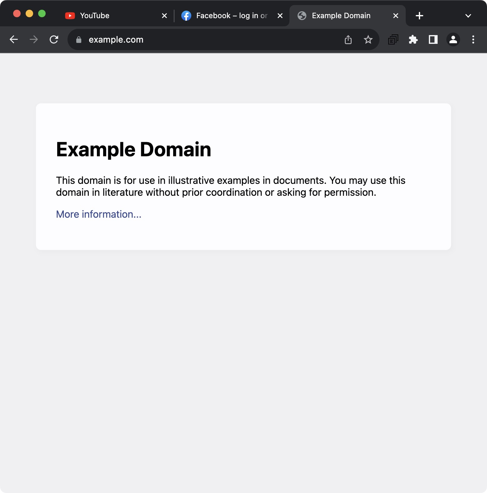
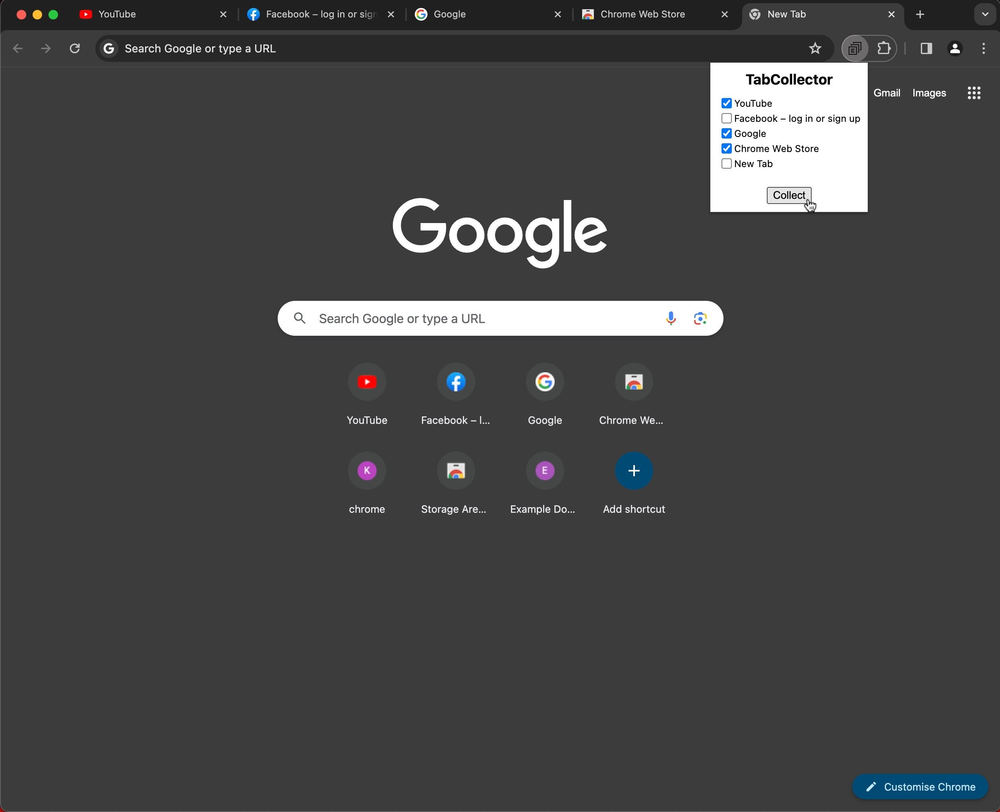
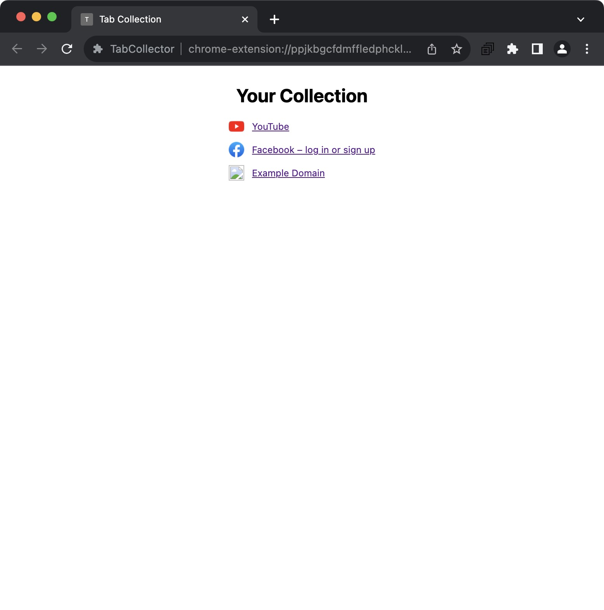

# TabCollector
A browser extension that collects a list of open tabs, then closes them to save resources.
Currently it is just a Chrome version, but we hope to create a FireFox version as well.

## Installation
### Chrome
It is currently not on the extension store - just follow these instructions:
1. [Download](https://github.com/pw-64/TabCollector/archive/refs/heads/main.zip) and extract (or clone) the repo
2. Open [chrome://extensions](chrome://extensions)
3. Enable Developer Mode
4. Click Load unpacked
5. Provide the `extension` folder

> [!IMPORTANT]
> The Chrome `.crx` files in [releases](https://github.com/pw-64/TabCollector/releases) have not been signed by Chrome Web Store, so you may get the warning `Package is invalid: 'CRX_REQUIRED_PROOF_MISSING'` - therefore, they will no longer be provided. You can still install the extension in Chrome by following the simple and easy [build instructions](https://github.com/pw-64/TabCollector/tree/main/building). Then go to chrome://extensions and enable "Developer Mode" and "Load unpacked" - select the `building/build/chrome` folder.

### Firefox
Please see [this discussion comment](https://github.com/pw-64/TabCollector/discussions/2#discussioncomment-8516525) for installing & developing the extension for Firefox.

### Other Browsers
If you would like to see this extension in another browser, please open an issue with the `[FEATURE]` tag.

## Feedback
Please share any thoughts in the [v1 Feedback Discussion](https://github.com/pw-64/TabCollector/discussions/1).

### Bug Reporting
Please share any bugs or errors you experience in an issue with the `[BUG]` tag.
Please include your browser, browser version, and extension version.
**Please search the open and closed issues to help avoid creating duplicates.**

## Credits
Thank you to the following projects and websites:
- [jQuery](https://github.com/jquery/jquery) - DOM manipulation and helpful utilities
- [LESS](https://github.com/less/less.js) - CSS precompiler
- [svgrepo](https://www.svgrepo.com) - Open-license SVG icons
- [svgcrop](https://svgcrop.com) - Remove empty space around SVGs

## Screenshots
### It is in active development so these will change

